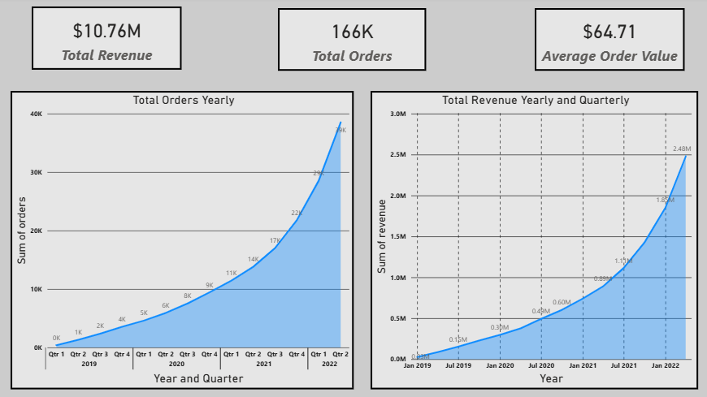
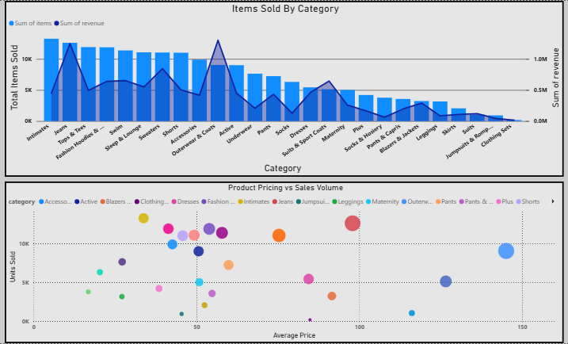
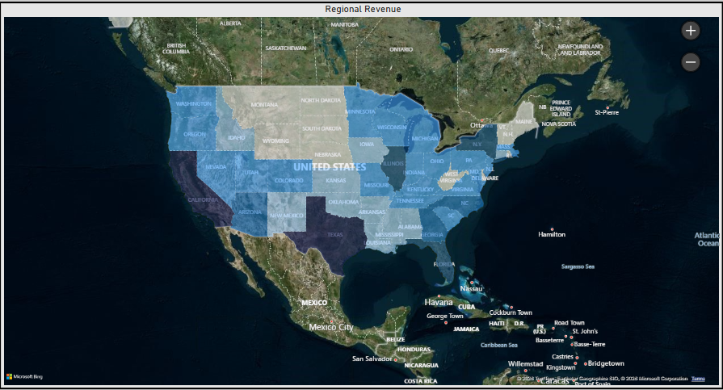
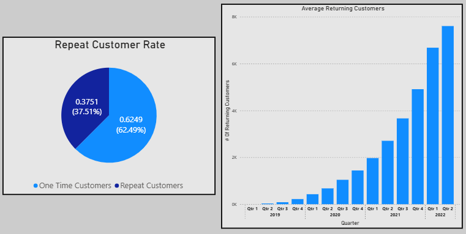
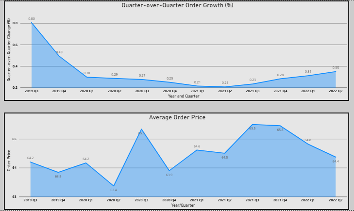

# E-Commerce Analytics Pipeline & KPI Reporting System

End‑to‑end analytics engineering and business intelligence project demonstrating how raw eCommerce operational data can be transformed into reliable, analytics‑ready datasets and executive dashboards using Apache Airflow, PostgreSQL, SQL, Python, Docker, and Power BI.

---

## Executive Summary

This project demonstrates how raw eCommerce operational data can be transformed into reliable, analytics‑ready datasets that support recurring KPI reporting and business decision‑making.

I designed and implemented an end‑to‑end analytics pipeline that automates data ingestion, transformation, and validation using Apache Airflow, SQL, and Python, and delivers standardized KPIs through Power BI dashboards. The pipeline emphasizes data quality, reproducibility, and separation of raw versus analytical layers — patterns commonly used in production analytics environments.

---

## Business Context

Leadership and operations teams require consistent, trustworthy metrics to monitor revenue performance, customer behavior, and product trends. Manual reporting and inconsistent transformations introduce risk, slow decision‑making, and reduce confidence in metrics.

This project simulates a real eCommerce analytics environment by:

* Ingesting raw transactional data
* Applying repeatable, version‑controlled transformations
* Defining consistent KPI logic in SQL
* Delivering insights through interactive BI dashboards

---

## Dataset

**theLook eCommerce Dataset** (fictional business data)

Relational schema including:

* Inventory Iems
* Orders
* Order Items
* Products
* Users

The dataset is treated as raw operational data and transformed into analytics‑ready fact and dimension views using SQL and Python.

---

## Tech Stack

* Orchestration: Apache Airflow (Dockerized)
* Data Warehouse: PostgreSQL
* Transformation: SQL, Python
* Visualization: Power BI
* Environment & Tooling: Docker, Git

---

## Architecture & ETL Process

* Apache Airflow orchestrates repeatable, idempotent ETL workflows
* PostgreSQL serves as the analytics warehouse
* Raw tables are preserved separately from curated analytics views
* SQL transformation layers produce standardized, documented KPI logic
* Docker provides a reproducible local development environment

High‑level flow:

Raw CSV → Airflow DAGs → Raw Tables → Analytics Views → Power BI Dashboards

---

## Data Model

The analytics layer follows a star‑schema‑style design:

* Fact tables

  * `fact_order_revenue` (order‑level revenue and volume)
  * `fact_order_items` (item‑level revenue and product analysis)

* Dimension tables

  * Users (customers)
  * Products
  * Distribution centers / regions
  * Time (quarters and dates)

* Curated analytics views

  * Customer quarterly performance
  * Category and state KPIs
  * Retention and repeat customer metrics
  * Fulfillment performance metrics

This design enables flexible slicing by customer, product, time, and geography.

---

## Key Performance Indicators (KPIs)

* Daily and Monthly Revenue
* Order Volume and Item Volume
* Average Order Value (AOV)
* Revenue by Product Category
* Customer Retention and Repeat Rate
* Regional Revenue Performance
* Fulfillment Time Metrics

---

## Reporting & Visualization

Power BI dashboards were built on top of analytics‑ready SQL views to:

* Monitor revenue and order trends over time
* Compare product category and pricing performance
* Analyze customer retention and repeat behavior
* Visualize regional sales distribution and growth drivers
* Identify pricing and volume trade‑offs across products

## Dashboards & Visualizations

### Business Performance



*Totals for the business as a whole from start to current date.*

### Product Category Performance



*Total revenue and order trends by product category highlighting top-performing segments.*

### Regional Revenue - US



*Revenue by States in the U.S; lighter colors = least sales, darker colors = highest sales.*

### Customer Retention Rate - US



*Rate that customers return to place atleast a 2nd order.*

### Quarter Growth and Average order price Quarterly - US



*Quarter by Quarter growth, and average order price quarterly.*

---

## Key Business Insights

* The company is in a sustained growth phase with increasing orders, revenue, and returning customers year over year
* **$10.76M** total revenue across **166K+ orders** with an average order value of **$64.71**
* Returning customer rate of **37.51%** indicates healthy repeat purchasing behavior
* Top sales category by volume: **Intimates**
* Highest revenue category: **Outerwear and Coats**
* California is the top U.S. state by revenue, with international sales across Europe, Australia, Asia, and South America

---

## Key Technical Features

* Automated ETL orchestration with Apache Airflow
* Separation of raw, staging, and analytics layers for data reliability
* Reusable SQL analytics views to ensure KPI consistency
* Idempotent pipeline design to support safe reprocessing
* Modular architecture enabling future incremental loading and scaling

---

## Running Locally

1. Clone the repository
2. Start services with:

   ```bash
   docker compose up -d
   ```
3. Access Airflow at: `http://localhost:8080`
4. Load analytics views into Power BI using the PostgreSQL connector

---

## Project Structure

```
.
├── dags/                 # Airflow DAG definitions
├── data/                 # Raw ingested CSV files
├── sql/                  # Analytics and KPI SQL views
├── docker-compose.yml    # Local orchestration
├── setup.env             # Environment configuration
└── README.md
```

---

## Future Improvements

* Incremental loading to reduce processing time for large datasets
* Data quality checks (row counts, null checks, schema validation)
* Slowly changing dimensions for customer and product attributes
* Parameterized KPI logic for multi‑region or multi‑brand reporting
* Migration to a cloud data warehouse (BigQuery, Redshift, Snowflake)

---

## Acknowledgments

Dataset provided by the **theLook eCommerce** public dataset (fictional business data for analytics practice).

---

